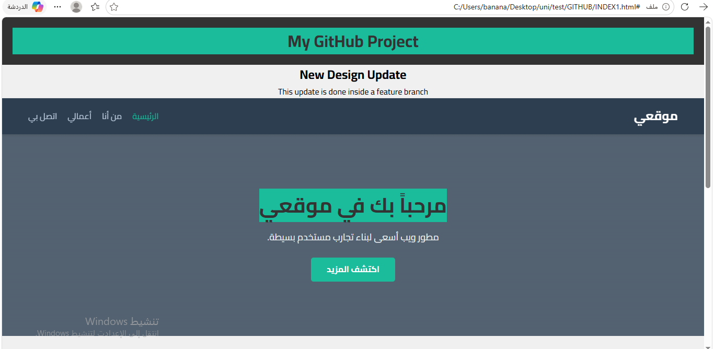
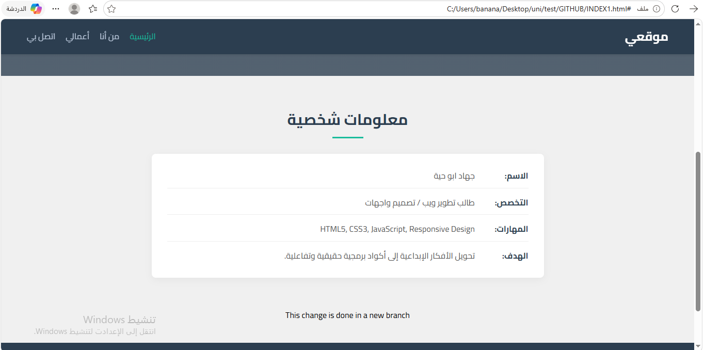

#  GitHub Training Project

---

##  Project Title
Git & GitHub Training Project

##  Project Description
This project is a simple web application built using HTML, CSS, and JavaScript.  
It was created to practice Git and GitHub workflows such as commits, branches, and pull requests.

The project demonstrates how to manage a real project using version control effectively.

##  Technologies Used
- HTML
- CSS
- JavaScript
- Git
- GitHub

##  Screenshots

##  How to Run the Project

git clone https://github.com/jehadhaiya/github-training-project.git

##  About Me

- Name: Jehad abo haiya 
- Location: Palestine  
- Role: Web Development Student  
- GitHub: https://github.com/jehadhaiya  